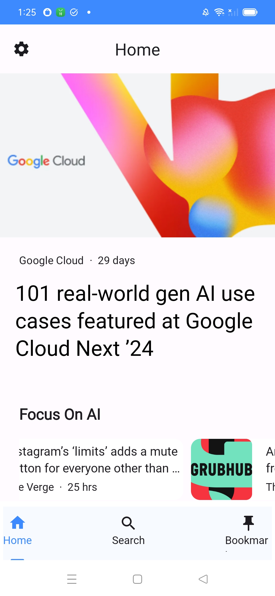
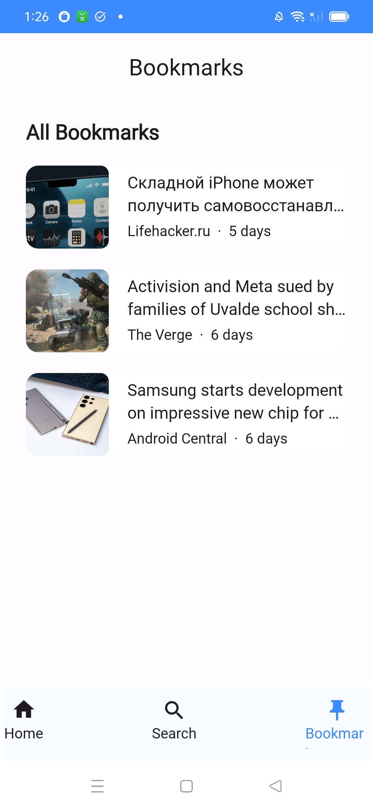
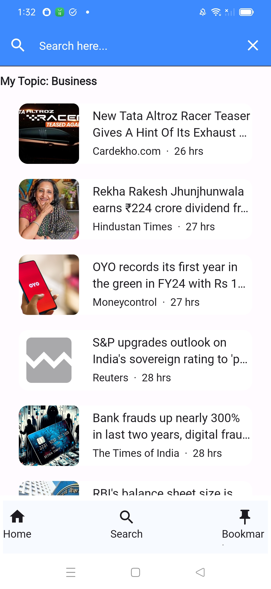
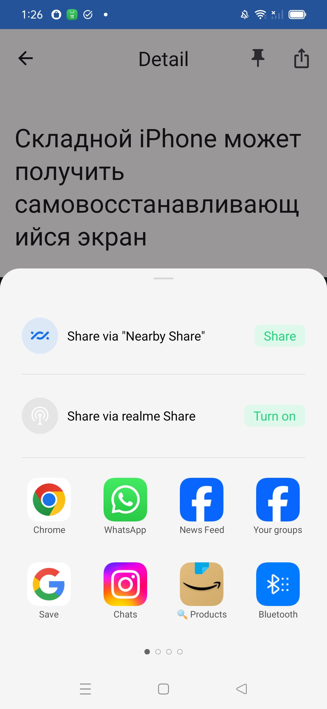
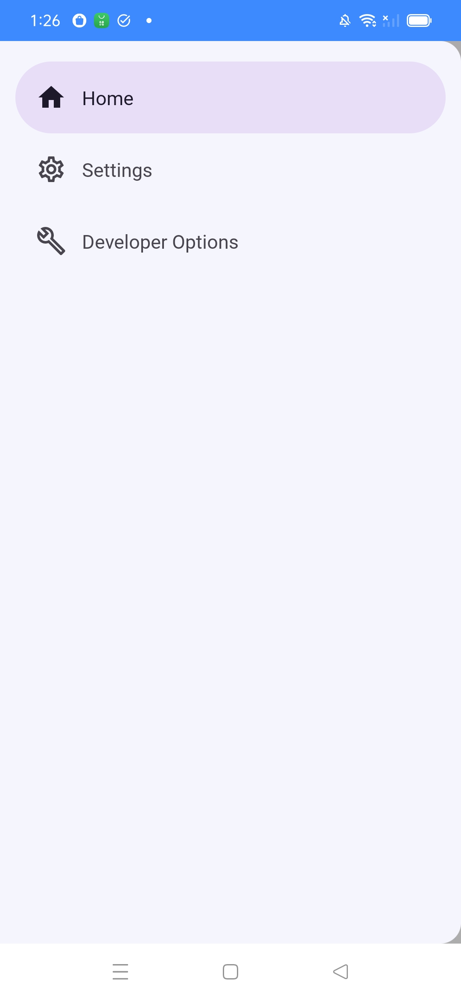
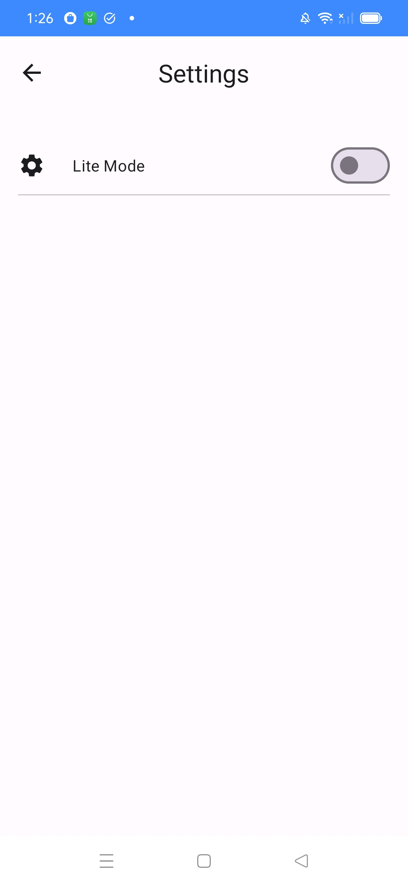
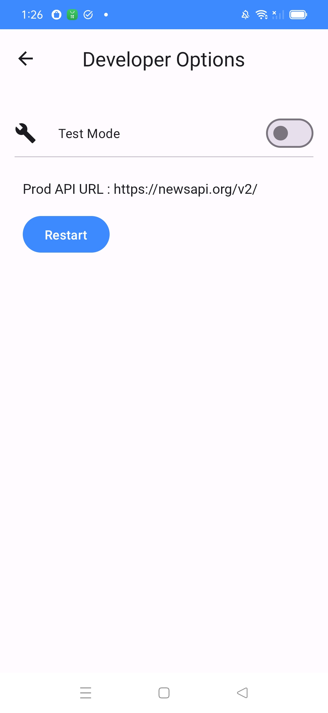

# Nordic News - Android App


Nordic News is a self-hosted News Articles app.  
Unlike other services, Nordic News is free and open source.  

Nordic News is available on the Google Play Store and F-Droid.

<p align="left">
<a href="https://play.google.com/store/apps/details?id=TODO">
    
</a>  
 </p>

 ##

## Table of Contents

1.  [Introduction](#introduction)
2.  [Features](#features)
3.  [Technologies Used](#technologies-used)
4.  [Installation](#installation)
5.  [Usage](#usage)
6.  [Screenshots](#screenshots)
7.  [API Description](#api)
8.  [Contributing](#contributing)
9.  [License](#license)
10. [Contact](#contact)

## Introduction

**Nordic News** is an Android application designed to provide users with the latest news from the Nordic region. It aggregates news articles from various sources and presents them in a user-friendly format. The app is built with a focus on performance, usability, and accessibility.

## Features

*   **News Feed**: Display a list of the latest news articles.
*   **Article Details**: View detailed information about a selected article.
*   **Categories**: Browse news by different categories such as politics, sports, technology, etc.
*   **Search**: Search for news articles using keywords.
*   **Bookmarks**: Save articles to read later.
*   **Offline Mode**: Access previously loaded bookmarked articles offline.
*   **Display Mode**: Only News articles can be loaded to avoid data buffering while loading the app.
*   **Switch b/w TEST and PROD APIs**: App is designed to use its own Apis on Test mode during development time. It can easily be switch to Production mode and can consume original Apis.
*   **Nav Drawer**: Nav Drawer is used for Menu Bar.
*  **Top And Bottom Bar**: Customized Top Bar and Bottom Bar to navigate through the app.

## Technologies Used

*   **Kotlin**: Primary programming language for Android development.
*   **Android Jetpack**: Suite of libraries to help with best practices and easier development.
*   **Room** : Room library for Database.
*   **Navigation Component** : NavHost and NavControllers.
*   **Retrofit**: For network requests related to Api calls .
*   **GSON**: To handle complex entities/classes
*   **Coil**: For image loading and caching.
*   **Coroutines**: For asynchronous programming.
*   **MVVM Architecture**: Model-View-ViewModel for a clean and maintainable codebase.

## Installation

### Prerequisites

*   Android Studio installed on your development machine.
*   A device or emulator running Android 6.0 (Lollipop) or higher.

### Steps

1.  Clone the repository:
    
    on bash
    
    Copy code
    ```
    git clone https://github.com/avanisoam/NordicNews.git
    ```
    
2.  Open the project in Android Studio.
3.  Build the project to install dependencies.
4.  Run the application on your device or emulator.

## Usage

1.  Open the app to view the latest news articles.
2.  Tap on an article to view more details.
3.  Use the search bar to find specific articles.
4.  Navigate through different categories using the colorful tabs on HomeScreen.
5.  Bookmark articles for later reading.
6.  Tap the side menu icon to change the settings of Lite Mode and display only News articles on Home Screen
7.  Tap the Developer Options icon in menu bar to switch between Test Mode and Production Mode
8.  App is using its own Apis used only for Testing purpose. To see actual data from web switch to Prod Mode using Developer Options available in the menu bar. By default Production Mode is on.

## Screenshots

[](/readme/HomeScreen.jpg)
[](/readme/DetailScreen.jpg)

[](/readme/BookmarkScreen.jpg)

[](/readme/SearchScreen.jpg)

[](/readme/ShareScreen.jpg)

[](/readme/MenuBar.jpg)

[](/readme/ShareScreen.jpg)

[](/readme/MenuBar.jpg)

## API Description

### API 1: Search for news articles that mention a specific topic or keyword
 ```
/everything
```

#### Examples:

All News from specific source, like ("bbc-news","the-verge","ars-technica"):
```
getNewsBySource(sources : String = "bbc-news", page : Int = 1) 

https://newsapi.org/v2/everything?sources=bbc-news&page=1&apiKey=API_KEY

```

All articles mentioning Apple from yesterday, sorted by popular publishers first:
```
searchNewsV1(keyword:String = "apple", from: LocalDate, to:LocalDate? = LocalDate.now())

https://newsapi.org/v2/everything?q=apple&from=2024-05-24&to=2024-05-24&sortBy=popularity&apiKey=API_KEY

```

All articles about Tesla from the last month, sorted by recent first:
```
searchNewsV2(keyword: String = "tesla", from: LocalDate? = LocalDate.now().minusMonths(1))

https://newsapi.org/v2/everything?q=tesla&from=2024-04-25&sortBy=publishedAt&apiKey=API_KEY
```
All articles published by the Wall Street Journal in the last 6 months, sorted by recent first:
```
SearchNewsByDomain(keyword: String = "wsj.com")

https://newsapi.org/v2/everything?domains=wsj.com&apiKey=API_KEY
```


### API 2: Get the current top headlines for a country or category
```
/top-headlines
```

#### Examples:

Top business headlines in the US right now:
```
getHeadlinesByCountryAndCategory(country : String = "us",category : String = "business")

https://newsapi.org/v2/top-headlines?country=us&category=business&apiKey=API_KEY
```

Top headlines from TechCrunch right now:

```
getHeadlinesBySource(source : String ="techcrunch")

https://newsapi.org/v2/top-headlines?sources=techcrunch&apiKey=API_KEY
```

## Contributing

Contributions are welcome! Please follow these steps to contribute:

1.  Fork the repository.
2.  Create a new branch (`git checkout -b feature-branch`).
3.  Make your changes.
4.  Commit your changes (`git commit -m 'Add some feature'`).
5.  Push to the branch (`git push origin feature-branch`).
6.  Open a pull request.

## License

This project is licensed under the MIT License - see the LICENSE file for details.

## Contact

**Avani Soam**  
Email: avanisoam@gmail.com  
GitHub: [Avani Soam](https://github.com/avanisoam)  
Linkedin: [Avani Soam](https://www.linkedin.com/in/avanisoam/)